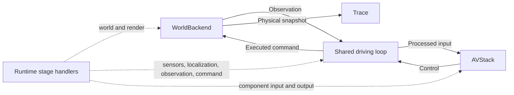

# Development

## Design principle: no parallel definitions

AVSecTester is a **security layer** on avstack + AlpaSim, not a re-implementation of either. The rule
that shapes the codebase: if an upstream project already defines something (the world, the ego,
sensors, the perception/tracking/planning/control modules, the Alpamayo policy, the config
registries and pre/post hooks), adapters use it directly. The shared runtime coordinates callbacks
and lifecycle across those adapters. It does not replace simulator actors or model components.
When a missing capability belongs to avstack, add it to the avstack fork.

Concretely:

- The driving loop uses the **pure data plane** (`Observation`/`Control`/`Trace` in `plane.py`)
  and **two interfaces** (`WorldBackend`/`AVStack` + `run` in `backend.py`). Scenario selection,
  insertion geometry and evaluation expose additional research-facing APIs in this repository.
  They reuse provider state and do not replace simulator actors or driving-model modules.
- The modular AV system is an **avcarla `CarlaMobileActor`** driven by an **avstack
  `ModularDrivingPipeline`**; the end-to-end one is NVIDIA's real **Alpamayo-1.5** model.
- CARLA world, traffic and ticking use **avcarla `CarlaClient` / `CarlaNpc`**. The NuRec adapter
  advances the ego with local planar dynamics and requests reconstructed views from NVIDIA's
  **`nre-ga`** renderer. Other actors follow recorded trajectories.
- Attack and defense use **`Runtime`** stage handlers with shared lifecycle management. Modular
  handlers bridge avstack pre/post hooks. `perturb(Observation)` remains an input shorthand.

## Architecture

The spine is one loop over a data plane. Adapters compose when their sensor, state and command
formats agree. The supported combinations and remaining adaptation work are listed in
[INTERFACE.md](INTERFACE.md#1-backend-and-stack-compatibility).

Before that loop, `ScenarioSource.scenarios(requirement)` prepares candidates and returns
`ScenarioInstance` objects. `case.make_backend()` reconstructs the selected origin for a paired
experiment. Selection filters stop at this boundary. Runtime insertion uses fixed actor bindings
and updates placement from the current pose. See [SCENARIOS.md](SCENARIOS.md) for the full workflow.



`run`, visualization recording and component logging share this loop. Runtime handlers replace
stage values before downstream consumption. Unsupported stages fail before reset. Observation
state and physical state remain independent. See [INTERVENTIONS.md](INTERVENTIONS.md) for
callback types, lifecycle and native resources.

The CARLA closed-loop driving pieces were contributed upstream into the forks (see
[`INTERFACE.md`](INTERFACE.md) §"What comes from avstack / AlpaSim"): `ModularDrivingPipeline`,
`ForwardCollisionPlanner`, and the `CarlaMobileActor` control loop. The NuRec renderer and the
Alpamayo model come from NVIDIA AlpaSim (`nre-ga`, `alpasim_driver`); `NuRecRenderer` and
`AlpamayoAVStack` are thin adapters behind the `WorldBackend`/`AVStack` interfaces.

## Layout

```
avsectester/
  plane.py            Observation · Control · WorldSnapshot · StateEstimate · Trace   (pure data)
  backend.py          WorldBackend · AVStack · run(...)             (interfaces + loop)
  runtime.py          Runtime · Hook · Plugin · contexts            (intervention execution)
  insertion.py        Insertion · placement/orientation · asset surfaces · pose resolution
  scenario.py         run_scenario   (compose a CARLA backend + modular stack)
  simulators/                                            (WorldBackend implementations)
    carla.py          CarlaBackend + camera_view (ImageData) · lidar_bev   (CARLA + its view adapters)
    nurec.py          NuRecBackend · Renderer · StubRenderer · NuRecRenderer · dynamics
    viz.py            record_run · detections_view · filmstrip · save_gif   (generic scene pipeline)
  stacks/                                                (AVStack implementations)
    modular.py        ModularAVStack (avstack ModularDrivingPipeline)
    alpamayo.py       AlpamayoAVStack (wraps alpasim_driver Alpamayo-1.5)
  scenarios/          select/build test cases meeting an attack's preconditions   (see SCENARIOS.md)
  evaluation/         robustness harness + component logging   (see AUGMENTATION.md, COMPONENT_LOGGING.md)
  attacks/
    pipeline/         Internal pipeline attacks: PhantomInjection (avstack HOOKS hook)
    patch/            Physical patch textures, configuration and deployment
    object_insertion/ Traffic signs, pedestrian images and traffic lights
    optim/            Shared PGD/NES algorithms, perturbations, objectives and scorers
  metric.py           impact(clean, attacked) -> Impact + plot_impact  (verdict + its figure)
  cli.py              `avsectester run ...`
```

Attack modules are grouped by function. Shared geometry and harmonization live in `rendering`,
while backend observation adapters and composition live in `simulators`.
For example, import `PhysicalPatch` from `avsectester.attacks.patch.physical_patch` and `SignAsset`
from `avsectester.attacks.object_insertion.sign_spoof`. The top-level
`from avsectester.attacks import PhantomInjection` entry point remains lazy; its implementation is
in `avsectester.attacks.pipeline.phantom`.

## Extending

- **A new world backend** — subclass `WorldBackend` (`reset`/`step`) and implement an independent
  `ground_truth()` snapshot. Use `run(...)` with a stack that consumes the provided observations
  and produces controls the backend can execute.
- **A new AV stack** — subclass `AVStack` (`__call__(obs) -> Control`); keep heavy imports lazy (as
  `AlpamayoAVStack` does) so the offline suite still imports in the base env.
- **An attack or defense** — register `Hook(stage, handler)` through `Runtime`. Handlers return
  replacement values. Stateful handlers provide lifecycle methods. See
  [INTERVENTIONS.md](INTERVENTIONS.md) for supported stages and custom adapter requirements.
  For a simple input-only function, `run(..., perturb=...)` remains available.
- **A modular white-box attack** — write a callable, `@HOOKS.register_module()` it (see
  `avsectester/attacks/pipeline/phantom.py`), and reference it in a scenario's `attacks:` list with the
  `stage` to hook. Removal, tracking-stage, and pre-hook (sensor-input) attacks use the same seam.
- **A new modular driving behavior** — add/replace an avstack planning or control module (in the
  fork) and name it in the pipeline config; the scenario is unchanged.
- **A new CARLA scenario** — copy `configs/carla_scenario.yaml`; change town/spawn/traffic/sensors/attack.
- **A selection filter** — implement `Constraint.evaluate(context) -> FilterResult` and compose it
  with existing filters. Native data access and resource ownership are described in
  [SCENARIOS.md](SCENARIOS.md#custom-filters-and-native-access).
- **A dataset or candidate provider** — expose prepared initial states and a factory that recreates
  the selected origin. Preserve actor IDs across the initial window and paired experiment.
- **An inserted asset** — implement `planes()` with asset-local `PlaneSurface` rectangles and use
  `Insertion` for placement. Reuse pose resolution, projection and visibility instead of defining
  a second attachment mechanism in an attack module.
- **A defense** — a handler at the effective stage, using the same lifecycle and return-value
  convention as an attack. Handler order is explicit and either category may be absent.

## Testing

Install the dependencies described in [tests/README.md](../tests/README.md). The `core` and
`avstack` directories run in CI; live tests are selected explicitly.

```bash
python -m pytest -q        # offline: interface + attack hook + pipeline + NuRec + viz, no CARLA/GPU
avsectester run configs/carla_scenario.yaml --frames 40   # CARLA end-to-end: needs a server + weights
python -m scripts.demos.nurec.alpamayo_nurec_demo 8 --save-frames     # Alpamayo+NuRec (driver env; needs nre-ga + a scene)
```

`tests/core/test_interface.py` exercises the `run` loop and the `perturb` seam on an in-memory
backend/stack. `tests/avstack/attacks/pipeline/test_phantom.py` checks the attack hook (appends exactly one fabricated
detection; registers in `HOOKS`). `tests/avstack/test_pipeline.py` builds `ModularDrivingPipeline` from
config and checks `ForwardCollisionPlanner` brakes for a forward-corridor track.
`tests/core/test_nurec.py` drives the in-process NuRec backend (dynamics, closed loop, checkpoint/restore)
against `StubRenderer`. `tests/core/test_sim_viz.py` checks the per-simulation scene views. None need
CARLA, a GPU, or the NuRec renderer.

## Roadmap

- More attacks: universal camera perturbations (the AlpaSim adversarial-render seam) against the
  end-to-end stack; modular detection removal, tracking-stage spoofing, sensor-input LiDAR spoofing.
- Extend defense implementations and add mitigation metrics appropriate to their experiment goals.
- A scenario-search engine: sweep worlds / traffic / attack parameters for the worst driving impact.
- Additional backend/stack combinations (Alpamayo in CARLA, the modular stack on NuRec sensors) and
  hardware-in-the-loop at the same `WorldBackend` seam.
