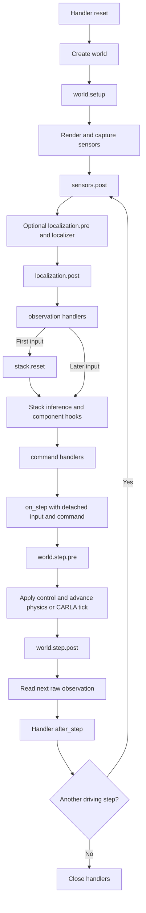

# Attack and defense interfaces

`Runtime` connects user-defined processing to the driving loop, simulator and model stages.
Attack and defense handlers use the same interface. They may replace a stage's data, keep
per-run state, or explicitly modify the simulated world through its native API.

No attack or defense is required. `run`, `record_run` and `run_logged` use the same execution
order. `run_scenario(..., runtime=...)` forwards the same runtime for the CARLA/modular entry point.
Optimization algorithms and scenario selection are separate from this interface.

## Register handlers

```python
from dataclasses import replace

from avsectester.backend import run
from avsectester.runtime import Hook, Runtime

def spoof_speed(observation, context):
    return replace(observation, ego_speed=20.0)

def limit_speed(observation, context):
    return replace(observation, ego_speed=min(observation.ego_speed, 10.0))

runtime = Runtime([
    Hook("observation", spoof_speed),
    Hook("observation", limit_speed),
], seed=0)

trace = run(backend, stack, frames=30, runtime=runtime)
```

Within a stage, handlers run in their registration order. Here the stack receives a speed of
10 m/s. Register only `spoof_speed` for attack-only execution, only `limit_speed` for
defense-only execution, or neither for an unchanged observation. The framework does not infer
an attack/defense ordering from the handler's class or name.

Use `Runtime()` for an empty chain, or omit `runtime`. The existing
`perturb(observation) -> Observation` argument is shorthand for a one-argument handler at
`observation`. When both are supplied, `perturb` runs before the registered `observation`
handlers. Prefer `Hook` when a handler needs context or lifecycle management.

## Supported stages

`backend.supported_stages` and `stack.supported_stages` declare adapter-specific stages.
The loop provides the common observation and command stages. Registration is checked before
the world is reset. An unavailable stage raises an error instead of accepting an inactive hook.

| Stage | Value passed to the handler | Availability and effect |
|---|---|---|
| `world.setup` | `None` | CARLA and NuRec, after world creation and before the first sensor observation |
| `world.step.pre` | `None` | CARLA and NuRec, before applying the current control and advancing physics |
| `world.step.post` | `None` | CARLA and NuRec, after physics/tick and before returning the next observation. Sensor-render timing depends on the backend. |
| `render.pre` | `RenderRequest` | NuRec, replace the camera or rendering pose for one camera |
| `render.post` | RGB image | NuRec, replace the rendered image for one camera |
| `sensors.post` | `Observation` | Common, modify captured sensor payloads and their metadata |
| `localization.pre` | `Observation` | Available when `Runtime(localizer=...)` is configured, modify its inputs |
| `localization.post` | `StateEstimate` | Common, modify the state estimate before it enters the observation |
| `observation` | `Observation` | Common, replace the final input passed to the stack, including initialization |
| `perception.pre`, `tracking.pre`, `planning.pre`, `control.pre` | `CallInputs` | Modular stack, only for actual modules whose calls dispatch native pre/post hooks |
| `perception.post`, `tracking.post`, `planning.post`, `control.post` | The component's output | Same modular capability requirement, replace the output consumed downstream |
| `policy.pre` | AlpaSim `PredictionInput` | Alpamayo, replace the input passed to `model.predict` |
| `policy.post` | AlpaSim `ModelPrediction` | Alpamayo, replace the prediction used to construct a trajectory |
| `command` | `Control` | Common, replace the final command applied by the backend |

Each handler returns the updated value of the same stage type. World callbacks return `None`
and perform explicit native operations. A component callback may mutate its output or return
a replacement. The returned value is always used by the next handler and downstream consumer.
If a handler returns mutable data borrowed from native resources, it is responsible for copying
that data when isolation is needed. Registering a hook does not change native ownership rules.

CARLA renders inside its server and does not expose `render.pre` or `render.post` through this
adapter. Use `sensors.post` for captured-data attacks or world callbacks for native world changes.
Alpamayo has no separate perception, tracking, planning or control modules. Its internal model
input is exposed through `policy.pre`.

CARLA sensors are rendered during `client.tick()`, before `world.step.post`. World changes in
that post callback affect subsequent ticks, not the image already captured by the completed tick.
Use `world.setup` or `world.step.pre` when the change must appear in the next captured observation.
NuRec renders after `world.step.post`, so changes at that stage affect its immediately following
rendering.

### Values that can be changed

| Value | Fields and interpretation |
|---|---|
| `Observation` | `sensor_data` maps IDs to native payloads. `calibration` holds adapter calibration. `vehicle_state` is the model-visible state estimate. `ego_speed` is the model-visible speed in m/s. `t` and `frame` are model-visible clock metadata. |
| `StateEstimate` | `vehicle_state` and `ego_speed`, independent of the physical ego state |
| `Control` | `throttle`, `brake`, `steer` and optional `trajectory`. CARLA uses throttle/brake in `[0, 1]` and steer in `[-1, 1]`. NuRec actuator dynamics use the same normalized convention. Handlers are responsible for suitable values. |
| `CallInputs` | `args` and `kwargs`, passed to the component's actual call signature. Return a new `CallInputs` to replace arguments. |
| `RenderRequest` | `pose` and `camera`. Changing the request changes that rendering, without moving the physical ego. |
| Alpamayo `PredictionInput` | Camera images and their history, speed, acceleration, ego pose history, command, route, inference seed and previous plan |
| Alpamayo `ModelPrediction` | Model output fields, including candidate positions, selected candidate and selected plan, according to the installed driver schema |
| Modular output | Native output type of the configured component, such as detections, tracks, plans or control |

For the built-in avstack `ModularDrivingPipeline`, the component inputs are:

| Component | Positional `CallInputs.args` | Keyword `CallInputs.kwargs` |
|---|---|---|
| Perception | Selected sensor payload | Component-specific options |
| Tracking | Detections | `platform`: estimated ego reference frame |
| Planning | Previous plan, estimated ego state, tracked objects | Component-specific options |
| Control | Estimated ego state, current plan | Component-specific options |

These signatures belong to the configured pipeline. Other pipelines can use different arguments.
Inspect `stack.native[component]` when implementing a callback for a custom module.

Sensor payload types remain native. A camera ndarray, avstack `ImageData`, point cloud, radar
measurement and navigation measurement have different fields. Use the relevant sensor adapter
or native API to modify them. An added sensor key affects driving only if a stack or localizer
consumes it.

The built-in ego state fields are:

| State field | Value and units |
|---|---|
| NuRec `vehicle_state.x`, `.y` | Planar position in the reconstruction world frame, in metres |
| NuRec `vehicle_state.yaw` | Heading about +Z in radians |
| NuRec `vehicle_state.speed` | Speed in m/s |
| NuRec `vehicle_state.t` | Simulation time in seconds |
| NuRec `RenderRequest.pose` | An `EgoPose` with the same fields, used for rendering only |
| CARLA `vehicle_state.position.x` | Three position coordinates in metres, expressed in `position.reference` |
| CARLA `vehicle_state.velocity.x` | Three velocity components in m/s, expressed in `velocity.reference` |
| CARLA `vehicle_state.acceleration.x` | Three acceleration components in m/s², expressed in `acceleration.reference` |
| CARLA `vehicle_state.attitude.q` | Native NumPy quaternion, orientation from its reference to the vehicle frame |
| CARLA `vehicle_state.t` | State timestamp in seconds |

CARLA's adapter converts native left-handed coordinates to avstack's right-handed coordinates.
The current ego vectors use the global reference frame. Preserve the reference graph when
changing a vector or quaternion and update linked pose/box data when your method requires it.

For a CARLA estimated-position offset:

```python
def offset_position(estimate, context):
    estimate.vehicle_state.position.x[0] += 5.0
    return estimate

runtime = Runtime([Hook("localization.post", offset_position)])
```

Fields are not automatically synchronized. The modular stack derives speed from
`vehicle_state.velocity`, while Alpamayo also uses the scalar `ego_speed`. To spoof both
consistently, change the velocity vector and set `estimate.ego_speed` to its intended norm.
An experiment may deliberately make them inconsistent. A changed field only affects components
that consume it.

For `TrajectoryFollower`, `Control.trajectory` is a sequence of
`((x, y, z), (w, x, y, z), timestamp_us)` waypoints. Positions are in the current rig frame
(X forward, Y left, Z up), quaternions use `wxyz`, and timestamps use the simulation clock in
absolute microseconds. Its current planar follower consumes X/Y motion. Other backends may
require a different trajectory adapter.
The follower interpolates from the current rig origin to the first waypoint, so the physics
step can be shorter than the waypoint interval without advancing to that waypoint early.

The modular stack consumes calibration and reference frames carried by avstack sensor wrappers.
Editing a separate `Observation.calibration` entry does not change a component that ignores that
mapping. For such a component, modify the wrapper's calibration/reference or its effective
input through a component pre-hook. Custom stacks may consume the canonical mapping directly.

## Execution order



NuRec capture invokes `render.pre` and `render.post` for each camera. Inference invokes the
component stages actually supported by the chosen stack.
NuRec renders the next images after `world.step.post`. CARLA captures its sensors during the tick
and reads those captured measurements afterwards.

The first observation is processed once. `stack.reset` and the first driving call receive the
same processed initial input. The final post-step observation is not transformed when no further
driving call is requested. `Trace` records the physical post-step state. Control at time *t*
affects subsequent observations.

With `frames=0`, the world and stack are initialized but no observation handlers or driving
steps execute. Handler lifecycle still runs.

`on_step(index, seen, control)` receives copied values after command processing and before
the world advances, with the capture ownership rules below. Use runtime handlers to alter
execution, and `on_step` for instrumentation.

## Truth, observations and native resources

`backend.ground_truth() -> WorldSnapshot` returns `t`, `frame`, `vehicle_state` and `ego_speed`
from the physical world. It is an independent snapshot. Editing it does not move the ego.
Other actors and additional metadata are accessible through native resources.
CARLA getters reflect the latest completed tick. Native commands can be asynchronous, so a
requested world change need not appear immediately in a snapshot or sensor measurement. NuRec's
in-process ego state is updated synchronously.

`backend.copy_observation(observation)` detaches mutable observation data, including state,
calibration and sensor reference graphs. Copying the graph together preserves shared references
within the copy while separating it from the backend.

Native CARLA C++ capture objects cannot be deep-copied and remain borrowed. Their Python wrappers,
calibration and reference graphs are detached. Capture metadata properties are read-only, but
the SDK supports item assignment that can modify LiDAR/radar points. Such edits can affect other
holders of that capture, including instrumentation copies. To preserve the original sensor input,
replace the capture in the copied wrapper with a private array or measurement supported by the
downstream component. This exception does not let observation edits move simulator actors.

| Interface | Meaning |
|---|---|
| Observation/state hooks | Change the model's measurements or estimated state |
| `context.ground_truth` | Read an independent physical-state snapshot at callback time |
| World callbacks and `context.backend.native` | Deliberately change the physical world using backend operations |
| Render callbacks | Change a rendering request or output without changing physical state |
| `context.stack.native`, `context.stack.models` | Access components, loaded models and adapter resources |

Access is not restricted by attack category. Native handles are borrowed live resources. The
framework does not sandbox their operations or automatically undo arbitrary user changes.
`models` exposes model/component handles without forcing lazy model loading.

Insertion geometry uses the effective camera rendering pose and scene time. Victim placement
uses the physical ego pose. Spoofing a model-visible position, orientation or timestamp does not
relocate the camera or host-bound insertion. When `render.pre` deliberately changes the request,
NuRec insertion follows that effective rendering viewpoint and scene time.
See [IMAGE_ATTACKS.md](IMAGE_ATTACKS.md) for asset placement and rendering.

## Context

`RunContext` is passed to lifecycle initialization. It provides `backend`, `stack`, `case`,
`rng` and `native` resources. `Runtime(case=...)` passes the caller's case through unchanged.
`native` groups resources under `"backend"` and `"stack"`.

Stage callbacks and `after_step` receive `StageContext`:

| Field | Meaning |
|---|---|
| `step` | Zero-based driving-loop index |
| `stage` | Stage currently executing, or `step.end` during lifecycle feedback |
| `sensor` | Native camera ID for per-camera rendering callbacks, otherwise `None` |
| `ground_truth` | Fresh independent `WorldSnapshot` from the backend |
| `sim_time` | Physical snapshot time |
| `observation` | Current observation when available, or the next raw observation during `after_step` |
| `control` | Current command, or `None` before the stack emits it. It is a snapshot outside `command` handlers. |
| `backend`, `stack`, `case`, `rng`, `native` | Run resources, also accessible through the run context |

Model-visible time and physical time can differ during a clock attack. Use `sim_time` or
`ground_truth.t` for physical scheduling. Do not assume `observation.t` is physical time after
an observation handler changes it.
At `command`, the handler value and `context.control` are the current command in the processing
chain. Elsewhere, editing the control snapshot does not change actuation or an executed command.

## Stateful attack or defense

The framework calls lifecycle methods automatically. The handler defines which of its own
fields must be cleared. One handler object registered at several stages is initialized and
closed once per run.

```python
from dataclasses import replace

from avsectester.runtime import Hook, Plugin, Runtime

class SmoothedSpeed(Plugin):
    def reset(self, context):
        self.previous = None

    def transform(self, observation, context):
        speed = observation.ego_speed
        if self.previous is not None:
            speed = 0.5 * self.previous + 0.5 * speed
        self.previous = speed
        return replace(observation, ego_speed=speed)

runtime = Runtime([Hook("observation", SmoothedSpeed())], seed=0)
```

`Plugin` supplies no-op `reset`, `after_step` and `close` defaults. Implement only those needed.
Alternatively use a callable object with `__call__(value, context)` and optional lifecycle
methods. Plain functions are valid handlers.

`reset(RunContext)` runs before backend reset. It can allocate resources and initialize state,
but actors created by reset are not available yet. Resolve new actors in `world.setup`.
`after_step(StageContext)` runs after a completed physical step and receives the next observation
and physical snapshot. It updates handler state and does not return a replacement stage value.
`step.end` is a lifecycle notification, not a stage registered with `Hook`.
Each participant receives its own copied observation and control for feedback, subject to the
native capture ownership rules above.
`close()` releases handler-owned resources on success or failure.

`Runtime(seed=...)` creates a fresh NumPy generator for each run. Use `context.rng` when the
handler needs repeatable random choices. This seed does not configure simulator, model or
external-library randomness. Initialize those through their own APIs as needed.

For a stateful closure without lifecycle methods, create a fresh closure and runtime per run.
The framework cannot infer how arbitrary Python variables should be reset.

The caller owns backend resources and closes the backend, as with ordinary `run`:

```python
try:
    trace = run(backend, stack, frames=30, runtime=runtime)
finally:
    backend.close()
```

Handler lifecycle and driving-model lifecycle are separate. The loop calls `stack.reset` once
per run. Alpamayo clears its camera history, previous plan and inference seed. The modular
adapter clears its telemetry but does not reconstruct stateful third-party trackers, planners
or controllers. Create a fresh `ModularAVStack` for independent experiments, or implement a
stack-specific reset for components whose state you manage.

## Sensor-driven localization

Without a custom localizer, the initial model-visible state comes from the backend observation.
CARLA and NuRec supply an independent ideal state by default. Explicit state edits made in
`sensors.post` are retained. Use `localization.post` or `observation` when the intended intervention
is on the estimated state rather than a sensor measurement.

To test a measurement attack through a localization algorithm, provide
`localizer(observation, context) -> StateEstimate`. It consumes the observation after
`sensors.post` and `localization.pre` and returns the estimated state used downstream.
The returned estimate is detached before `localization.post`, so a localizer may return cached
state without later input edits modifying that cache or the backend's physical state.

```python
from avsectester.plane import StateEstimate
from avsectester.runtime import Hook, Runtime

def localize(observation, context):
    estimate = estimator.update(observation.sensor_data, observation.calibration)
    return StateEstimate(vehicle_state=estimate, ego_speed=estimate.speed)

runtime = Runtime([
    Hook("sensors.post", measurement_attack),
    Hook("localization.post", estimate_defense),
], localizer=localize)
```

Here `estimator`, `measurement_attack` and `estimate_defense` are caller-provided implementations.
Changing a GNSS or IMU measurement will affect the state estimate only if the configured localizer
actually uses it. A stateful localizer can expose the same lifecycle methods as a handler.

## World changes and custom adapters

World callbacks make explicit native changes and return `None`. For a NuRec ego-world change:

```python
def move_initial_ego(value, context):
    context.backend.pose.x += 1.0
    return None

runtime = Runtime([Hook("world.setup", move_initial_ego)])
```

The new physical position is used by subsequent rendering and dynamics. For CARLA, the native
mapping exposes `client`, `world`, `ego`, `lead`, `npcs` and `actors`. The `actors` mapping holds
raw actors under logical names such as `ego`, `lead` and `npc:0`. Use CARLA operations such as
actor pose updates or `world.set_weather(...)`. NuRec exposes `renderer` and `dynamics` and its
owned `pose`. A native modification only works when that backend supports the operation.

`NuRecBackend.render_request(camera)` accepts a native camera name or configured alias and returns
an independent copy of the request that produced the current image. `native["render_requests"]`
also contains copied requests. Editing those inspection copies does not affect rendering.
Use `render.pre` to replace an upcoming request.

A custom `WorldBackend` or `AVStack` declares its `supported_stages` and invokes
`self._emit(stage, value, sensor=None)` at the effective execution point. Preserve the returned
value and pass it to the next computation. Emit setup before the first capture, the pre-step
stage before actuation, and the post-step stage after physical advancement. Document whether
sensor rendering occurs during advancement or after the post-step stage.
Custom backends implement an independent `ground_truth`
snapshot and, when necessary, a native-aware `copy_observation` method. See
[INTERFACE.md](INTERFACE.md) for the base backend and stack contracts.
