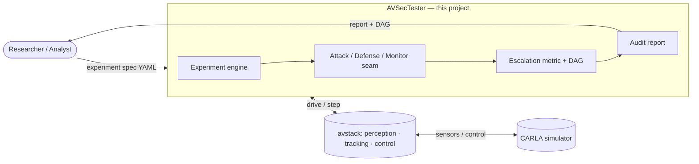
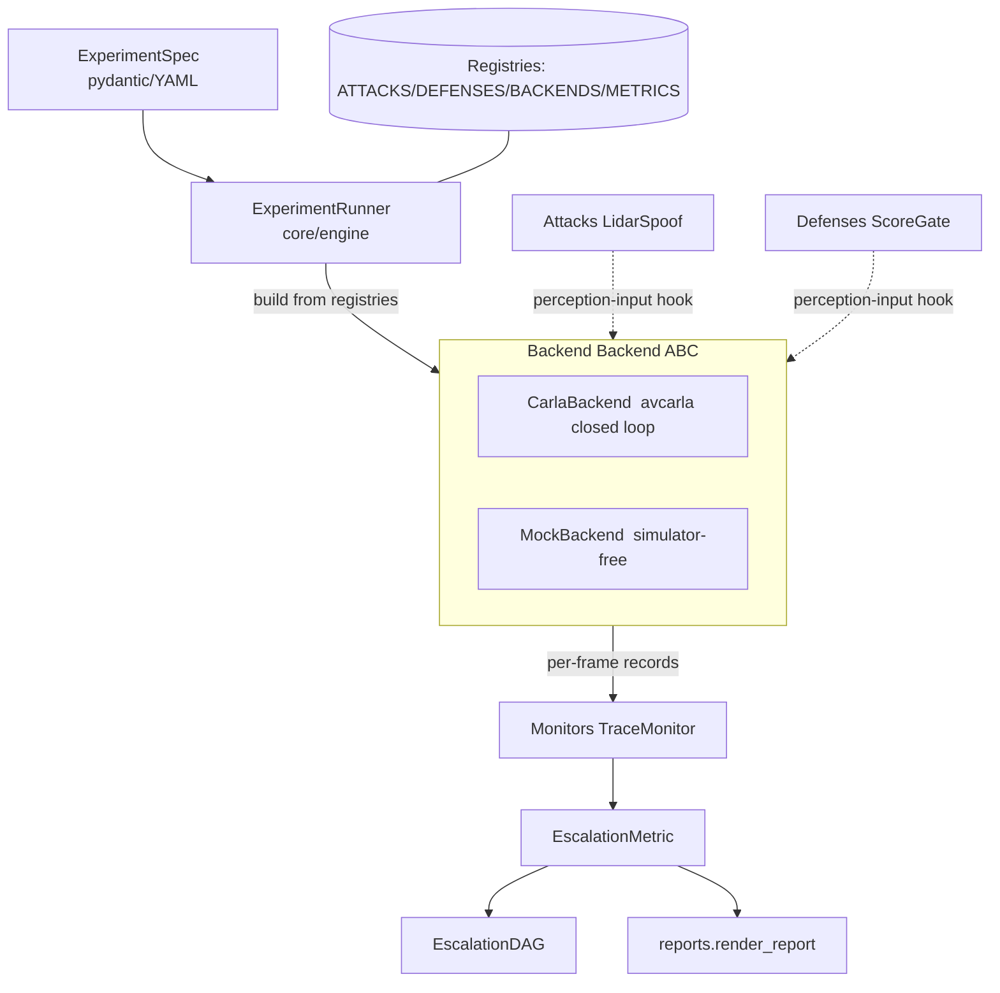

# AVSecTester — Project Summary

## 1. Executive Summary

Autonomous-vehicle (AV) stacks are attacked through their sensors and software, yet most
testing tools only measure functional safety or model accuracy — not whether an adversarial
attack actually *reaches an unsafe driving outcome*. **AVSecTester** is a closed-loop
adversarial stress-testing framework that treats attacks as first-class entities and traces
each one along an **attack-escalation path**: from an injected signal, through component-level
errors (perception, tracking, planning), to the closed-loop driving consequence.

Built as a security layer on top of the [avstack](https://github.com/avstack-lab) ecosystem
(CARLA closed-loop + mmdetection3d perception), it runs a single YAML experiment spec through
paired **clean / attacked / defended** passes and emits a quantitative audit: activation,
propagation, persistence, safety consequence, and mitigation — plus the escalation DAG that
explains *how* the attack propagated. Intended users are AV security researchers, AV developers,
and security analysts who need reproducible, standardized evidence of exploitability rather than
ad-hoc, one-off attack scripts.

## 2. Problem and Motivation

AV perception and planning are safety-critical and demonstrably attackable (LiDAR spoofing,
adversarial patches, GPS/V2X manipulation). But the field lacks a *systematic* way to answer the
question that matters to safety: **does an attack on a component actually change how the vehicle
drives, under what conditions, and can it be mitigated?**

- **Existing tools are misaligned.** AV test suites (scenario fuzzers, robustness benchmarks)
  target functional safety and natural distribution shift, not adversaries. ML-robustness tools
  measure *model-output degradation* on static datasets — they stop at "accuracy dropped," never
  reaching the closed-loop consequence.
- **Attack research is fragmented and non-reproducible.** Each paper ships a bespoke script tied
  to one model, one dataset, one coordinate convention. Results rarely transfer, are hard to
  compare, and almost never run end-to-end in a simulator with feedback.
- **Who feels it:** AV security researchers (re-implement plumbing every time), AV developers and
  integrators (no standardized way to audit a stack before deployment), and security analysts /
  regulators (no comparable, evidence-backed vulnerability reports).
- **Manual/hard today:** wiring an attack into a real closed loop, comparing clean vs. attacked
  runs, attributing a driving failure to a root-cause component, and testing whether a defense
  actually helps — all manual, brittle, and rarely closed-loop.
- **Why now:** AVs are deploying at scale, avstack provides a reusable closed-loop CARLA + mmdet3d
  substrate to build on, and standards/assurance bodies increasingly demand reproducible security
  evidence.

## 3. Goals and Targeted Users

**Goals (concrete outcomes):**

- Treat attacks/defenses as pluggable, first-class entities attached at well-defined seams (no
  forking of the AV stack).
- Run one reproducible experiment spec across **multiple backends** (CARLA closed-loop today;
  offline dataset planned) and multiple AV configurations.
- **Automate** the clean-vs-attacked-vs-defended comparison and environment/config setup.
- Provide **standardized evaluation**: activation, targeting, persistence/propagation, safety
  consequence, detectability, mitigability — with an auditable escalation DAG.
- **Reduce integration effort** by reusing avstack's CARLA/mmdet3d bridges and coordinate handling.

**Targeted users:**

| User | Uses AVSecTester to… |
|---|---|
| **Security researchers** | prototype attacks/defenses behind stable seams; get comparable metrics |
| **AV developers** | audit a candidate stack for exploitable escalation before deployment |
| **Security analysts / assessors** | produce reproducible, evidence-backed vulnerability reports |
| **System integrators** | check that swapping a component/defense changes the safety outcome |
| **Students / educators** | study end-to-end attack escalation without building the plumbing |

## 4. System Scope and Conceptual Model

**Inputs:** an experiment spec (YAML) — the AV system config, scenario/backend, attack, defense,
and metrics. **Outputs:** an audit report (verdict + security metrics), the attack-escalation DAG,
and paired execution traces. **External systems it drives:** the CARLA simulator and the avstack
stack (avcarla closed loop, mmdetection3d perception). **This project owns** the security layer:
the experiment engine, the attack/defense/monitor seams, the escalation metric + DAG, and
reporting. **External tools own** the simulator, the AV modules (perception/tracking/planning/
control), datasets, and model checkpoints.

## 5. Architecture Overview

- **`core`** — `ExperimentSpec`, `ThreatModel`, plugin interfaces, the `EscalationDAG`, and the
  `ExperimentRunner` engine.
- **`backends`** — `CarlaBackend` (real avcarla closed loop) and `MockBackend` (CARLA-free
  synthetic world running the same avstack perception→tracking→control loop). Both expose a
  **perception-input hook seam** (`add_perception_hook`) and a forward-collision brake reflex so
  component errors reach the driving layer.
- **`attacks` / `defenses`** — hook-shaped plugins (`apply(data, ego_state=…) → data`). Baseline:
  `LidarSpoofAttack` (phantom injection), `ScoreGateDefense` (confidence gate).
- **`monitors`** — lift per-frame backend records into per-stage traces (`TraceMonitor`,
  `diff_traces`).
- **`metrics` / `reports`** — `EscalationMetric` scores paired traces and builds the DAG;
  `render_report` emits the markdown audit.
- **`config`** — OpenMMLab-style registries (reused from avstack) so plugins build from
  `{"type": name, …}` config.

Attacks/defenses/monitors attach as **avstack-style pre/post hooks** — no forking of the AV stack.

## 6. Key Workflows

1. **Run a security experiment.** `avsectester run configs/mock_experiment.yaml` → the engine
   builds the backend/attack/defense from the spec, runs a **clean** baseline and an **attacked**
   pass (attack injected at the perception seam), scores them, and prints the escalation report.
2. **Measure a defense.** If the spec declares a defense, the engine adds an **attacked+defended**
   pass and reports whether the escalation was `mitigated`.
3. **Trace escalation.** Each run yields paired traces; `diff_traces` finds the earliest per-stage
   divergence; `EscalationMetric` builds the `attack_surface → perception → tracking → control →
   consequence` DAG with per-stage evidence and a root cause.
4. **Portability across backends.** The *same* spec runs on `MockBackend` (CI, no simulator) and
   `CarlaBackend` (closed-loop CARLA), proving results aren't tied to one execution environment.

## 7. Testing and Validation Plan

- **Core scaffold tests** (`tests/test_scaffold.py`) — schema round-trip, registry population,
  DAG helpers, example-config validation. Run with no heavy dependencies (core-only CI).
- **Attack-seam tests** (`tests/test_attack_seam.py`) — phantom injection geometry, world-fixed
  persistence, propagation to a confirmed track, threat-budget validation. avstack-gated, no CARLA.
- **End-to-end engine test** (`tests/test_engine.py`) — full spec→engine→metric→DAG→report on
  `MockBackend`: asserts escalation (5-stage DAG, forced stop) and defense mitigation. avstack-
  gated, no CARLA — so the whole pipeline is exercised in CI without a GPU/simulator.
- **Closed-loop smoke tests** (`scripts/smoke_*.py`) — GPU perception CUDA ops and a CARLA
  ego+LiDAR sync loop; manual, hardware-dependent.
- **Reproducibility** — deterministic `MockBackend`, pinned environment (`requirements.lock`,
  `docs/SETUP.md`), and spec-level provenance (`ReproducibilityInfo`).
- **Roadmap** — statistical repetition harness (activation reliability across seeds), coordinate-
  frame round-trip tests, and gated closed-loop CARLA regression on a GPU runner.
