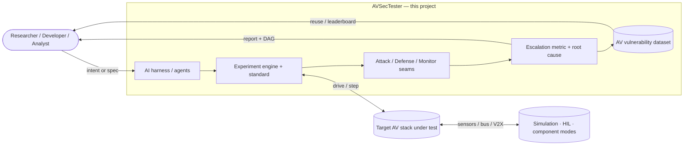
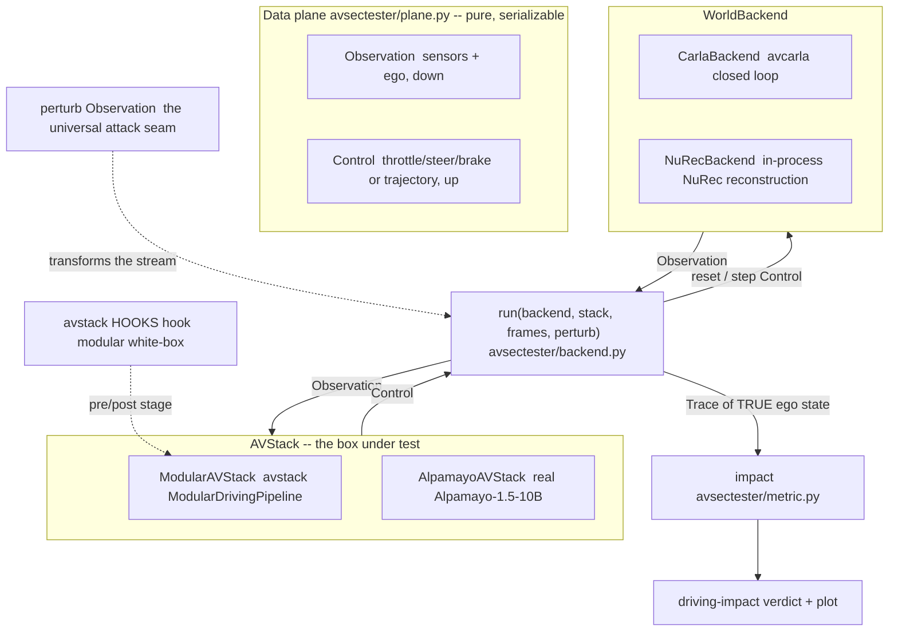

# AVSecTester — Project Summary

A unified, closed-loop adversarial security-testing framework for autonomous-vehicle systems.

## 1. Executive Summary

Autonomous-vehicle (AV) stacks are attacked through their sensors and software, yet neither
industry practice nor academic research has a mature, shared way to decide, for a given system,
whether an attack is a real safety risk, and how severe. Testing tools measure functional safety
or model accuracy; they do not evaluate a system implementation against assumed adversarial
threats under a common standard, and they stop short of the closed-loop driving consequence.

We propose to build **AVSecTester**, an adversarial security-testing framework for AV stacks. It
treats attacks as first-class entities and traces each one along an **attack-escalation path**
that runs from an injected signal, through component-level errors, to the closed-loop driving
outcome. As a result, every finding carries not just an observed phenomenon but an in-depth,
root-cause diagnosis.

Specifically, a single experiment specification runs against a target system under one standard
across several testing modes: componential, closed-loop simulation, and hardware in the loop. The
testing covers in-vehicle network security, cross-vehicle communication security, and adversarial
threats to AI-powered perception and planning pipelines. Each run produces a quantitative audit
covering activation, propagation, persistence, safety consequence, and mitigation, together with
the escalation graph. Results are designed to be reusable: a common interface indexes them into an
**AV vulnerability dataset** that resembles CVE but focuses on AV safety impact, and an **AI agent
harness** automates implementation and transfer to move testing toward a push-button experience.
The intended users are AV security researchers, AV developers, and security analysts who need
reproducible, standardized, and transferable evidence of exploitability rather than one-off attack
scripts.

## 2. Vision and Goals

Three gaps motivate this work:

1. **There is no unified adversarial-testing standard.** Production AV validation centers on
   functional safety and environmental robustness; it does not sufficiently account for
   adversarial threats, and there is no common testing principle or framework to evaluate a system
   implementation against assumed attacker capabilities. Security testing is ad hoc and
   vendor-specific, so results are neither comparable nor auditable.
2. **Industry security testing is slow to absorb new research.** The attack/defense literature
   advances quickly, but industry has no quick, up-to-date path to sync with the latest
   discoveries. Teams lack a framework to rapidly transform a research idea into a runnable test
   and validate it against an actual system design, so newly published vulnerabilities go
   unchecked for long periods.
3. **Academic research builds on heterogeneous, hard-to-compare assumptions.** Security research
   varies widely in its system assumptions, attack scenarios, and assumed attacker power. Because
   these premises differ from study to study, the security risk each reports is difficult to assess
   in terms of feasibility, impact, and severity, and findings rarely transfer across systems.

The net effect: attacks are demonstrated in isolation, but their real, closed-loop safety
consequence, and whether a defense meaningfully reduces it, remains uncertain, non-comparable, and
non-reusable. As AVs deploy at scale and assurance bodies increasingly demand reproducible security
evidence, a unified, traceable, and reusable testing methodology is needed now. AVSecTester answers
this with four design commitments:

- **A unified testing tool: one standard, multiple modes.** Test a target system implementation
  against assumed adversarial threats under a common standard, across componential testing
  (module-level), simulation closed-loop testing (e.g., CARLA / AlpaSim), and hardware-in-the-loop
  testing (e.g., Block Harbor VSEC).
- **Traceability and reproducibility by design.** Go beyond observing phenomena: built-in in-depth
  diagnosis and root-cause analysis via the attack-escalation path, so every result explains how
  the attack propagated to a driving consequence.
- **Reusable results: an AV vulnerability dataset.** A common interface indexes testing results
  into a shared dataset, CVE-like but focused on AV safety impact, so the community can build a
  comparable picture of the vulnerability landscape.
- **An AI harness toward push-button testing.** An AI layer leverages model capability to automate
  implementation and transfer, turning research artifacts into deployable tests on actual system
  designs, moving security testing and evaluation toward a push-button experience.

**Targeted users:**

| User | Uses AVSecTester to… |
|---|---|
| **Security researchers** | rapidly turn a research idea into a standardized, runnable test; get comparable metrics |
| **AV developers** | audit a candidate stack for exploitable escalation before deployment |
| **Security analysts** | produce reproducible, evidence-backed vulnerability reports and index them for reuse |
| **System integrators / manufacturers** | check that swapping a component or defense changes the safety outcome |
| **Students / educators** | study end-to-end attack escalation without building the plumbing |

## 3. System Scope and Conceptual Model

The framework audits a target AV system implementation against a declared threat model, then
reports whether and how that threat reaches a safety consequence.

**Inputs.** An experiment specification describing the target system configuration, the driving
scenario, the threat model, one or more attacks, optional defenses, and the metrics to compute.
Specifications can be written by hand or generated by the AI harness from natural language or a
research artifact.

**Target system and attack surfaces.** The target is a full AV stack (perception, localization,
prediction, planning, control); different AV stacks can be built on [avstack](https://www.avstack.org/).
Its attack surfaces span the whole vehicle rather than cameras and LiDAR alone:

- **Sensor attacks:** spoofing, jamming, and injection against LiDAR, camera, radar, and GNSS.
- **AI adversarial attacks:** digital perturbations and physical adversarial objects and patches
  against the perception and prediction models.
- **In-vehicle network attacks:** intrusion on CAN or automotive Ethernet, message injection, and
  compromised ECUs.
- **V2X communication attacks:** falsified, replayed, or Sybil messages in vehicle-to-vehicle and
  infrastructure links.

**Testing modes and environments.** One standard applies across three modes: componential testing
of an isolated module, closed-loop simulation, and hardware in the loop. Simulation is
simulator-agnostic: it can use conventional engines such as CARLA and AI-generative scenario
engines such as NVIDIA AlpaSim, so scenarios can be both realistic and automatically diversified.
Hardware-in-the-loop testing can bridge the interface of Block Harbor VSEC; the user configures the
hardware to test and the benchmark setting, while the system generates audit reports either on the
isolated component or in the closed-loop simulated driving tests.

**Defenses.** Defenses are general and pluggable: input anomaly detection, temporal and
cross-sensor consistency checking, in-vehicle network intrusion detection, authenticated or
trust-scored V2X, runtime safety monitors such as RSS, and attack-aware fallback policies.

**Outputs.** An audit report with security metrics, the attack-escalation DAG and its root cause,
paired execution traces, and vulnerability records indexed into the shared AV vulnerability dataset.
This project owns the security layer: the testing standard and engine, the attack, defense, and
monitor seams, the escalation metric and root-cause analysis, the vulnerability-dataset interface,
and the AI harness. External tools own the simulators and generative scene engines, the AV modules
under test, real vehicle hardware and buses in hardware-in-the-loop, datasets, and model checkpoints.

**The AI harness layer.** An AI harness turns the framework into a largely automated workflow.
Given a natural-language goal or a research paper, agents draft the experiment specification,
implement or adapt the attack and defense against the target system, and select the scenarios,
simulator, and testing mode. They then orchestrate the runs, read the diagnosis traces and
escalation DAG, and summarize what happened and why. The goal is to bring security testing and
evaluation close to a push-button experience, where a user states an intent and receives a
reproducible, diagnosed result.

**The open vulnerability database and leaderboards.** Every experiment is recorded into a shared
AV vulnerability dataset through a common interface. Each entry captures the attack description
together with its configuration and characteristics (the threat model, attack surface, assumed
attacker knowledge and power, and attack parameters), combined with the tested results the
framework produces across diverse conditions: different system implementations and models,
scenarios, simulators, and testing modes. Alongside these it stores the diagnosis traces and the
escalation DAG that produced them, so an entry carries both the exact setup and the evidence behind
its verdict. A leaderboard additionally compares different attacks and defenses comprehensively,
helping to track state-of-the-art security innovations.

## 4. Architecture Overview (current implementation)

The vision above is realized incrementally. Today's framework implements the closed-loop path on a
**pure data-plane spine** shared by two world backends and two AV stacks — a 2×2 that any attack, as
a stream transform, plugs into uniformly. See [`INTERFACE.md`](INTERFACE.md) for the full contract.

- **`plane`** — `Observation` (down), `Control` (up), and the `Trace`/`FrameRecord` driving record.
  Pure data; no `carla`/`avcarla`/`torch`/`avstack` imports, serializable so the loop can split
  across processes.
- **`backend`** — the `WorldBackend` / `AVStack` interfaces and `run(backend, stack, frames,
  perturb=None)`. `perturb: Observation -> Observation` is the **single universal attack seam** — it
  works against any stack, black-box included — and the `Trace` records the backend's *true* ego
  state, not the perturbed view.
- **World backends** — `CarlaBackend` (`scenario.py`; real avcarla closed loop) and `NuRecBackend`
  (`simulators/nurec.py`; in-process NVIDIA NuRec neural reconstruction with a pluggable renderer —
  `StubRenderer` for CI, `NuRecRenderer` → the `nre-ga` gRPC renderer).
- **AV stacks** — `ModularAVStack` (`scenario.py`; an avstack `ModularDrivingPipeline`, the modular
  white-box mode) and `AlpamayoAVStack` (`stacks/alpamayo.py`; the real end-to-end Alpamayo-1.5-10B
  policy, the black-box mode). These are the first two of the three planned testing modes;
  hardware-in-the-loop attaches at the same `WorldBackend` seam.
- **`attacks`** — universal as `perturb(Observation)`; modular-internal as an avstack `HOOKS` hook on
  a pipeline stage (baseline `PhantomInjection`). A defense is the same shape — a sanitizing hook.
- **`metric` / `viz`** — `impact(clean, attacked)` scores the paired traces into a driving-impact
  verdict and `metric.plot_impact` renders the clean-vs-attacked figure, while `simulators/viz` saves
  per-simulation scene views.

Attacks/defenses attach either at the universal `perturb` seam or as **avstack-style pre/post hooks**
— no forking of the AV stack.

## 5. Key Workflows

1. **Run a modular security experiment.** `avsectester run configs/carla_scenario.yaml` → builds the
   `CarlaBackend` + `ModularAVStack` scenario from config, runs a **clean** baseline and an
   **attacked** pass (attack = an avstack hook on a pipeline stage), scores them with the impact
   metric, and prints the driving-impact report.
2. **Test an end-to-end policy.** `run(NuRecBackend(NuRecRenderer), AlpamayoAVStack, frames)` drives
   the real Alpamayo-1.5 policy on photoreal NuRec-reconstructed imagery
   (`scripts/alpamayo_nurec_demo.py`); a camera `perturb` is the black-box attack seam here.
3. **Mix and match.** The same `run(...)` loop composes any of the 2×2 — a stack is validated across
   worlds, and a world exercises different stacks, proving a result is a property of the system under
   test, not one execution environment. The same seam extends to hardware-in-the-loop.
4. **Measure a defense.** Add a sanitizing hook (modular) or an input filter (universal) and compare
   the impact with and without it.
5. **Reuse a result.** Each verdict and its paired traces are indexed through the
   vulnerability-dataset interface (planned), so a finding is comparable and reproducible rather than
   one-off.

## 6. Testing and Validation Plan

Validation targets both the framework's correctness and the credibility of the security verdicts it
produces.

- **Escalation soundness:** confirm that a known attack activates, propagates across components, and
  changes the closed-loop driving outcome, and that the escalation path attributes the consequence
  to the right root-cause component.
- **Defense measurability:** confirm that adding a defense demonstrably reduces or removes the
  escalation, and that the metrics distinguish mitigation from suppression.
- **Cross-mode consistency:** run the same specification across componential, simulation, and
  hardware-in-the-loop modes and check that verdicts agree where they should, so a result is a
  property of the system under test, not of one execution environment.
- **Simulation fidelity:** assess whether a simulator's sensor, physics, and scenario fidelity is
  sufficient to support a security conclusion, calibrate it against hardware-in-the-loop and
  real-world data, and record the sim-to-real gap so each verdict carries its fidelity assumptions.
- **Reproducibility and provenance:** deterministic baselines, pinned environments, and spec-level
  provenance so every recorded verdict can be re-run and audited.
- **Statistical reliability:** repeat runs across seeds and scenario variations to report activation
  reliability and confidence, not single-shot anecdotes.

**Current implementation status.** Two closed loops are verified end-to-end: the neural CARLA
modular loop (`avsectester run configs/carla_scenario.yaml`) and the **real Alpamayo-1.5-10B policy
driving on real NuRec-rendered imagery** (`scripts/alpamayo_nurec_demo.py`). The offline suite runs
in CI without a GPU or simulator: `tests/test_interface.py` (the `run` loop + the `perturb` seam on
an in-memory backend/stack), `tests/test_phantom.py` (phantom-injection geometry, world-fixed
persistence, propagation to a confirmed track), `tests/test_pipeline.py` (the avstack
`ModularDrivingPipeline` builds from config and `ForwardCollisionPlanner` brakes for a
forward-corridor track), `tests/test_nurec.py` (the in-process NuRec backend, dynamics, and
checkpoint/restore against `StubRenderer`), and `tests/test_sim_viz.py` (the per-simulation scene
views). Closed-loop CARLA and the NuRec renderer are manual and hardware-dependent. The environments
are pinned (`docs/SETUP.md`).
